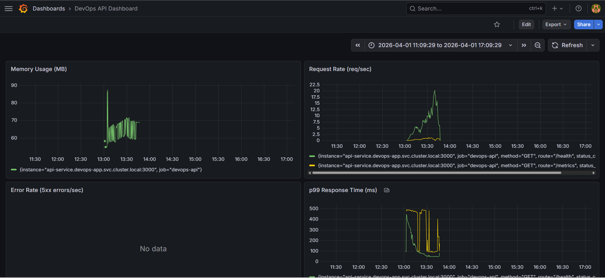

# DevOps Portfolio Project 🚀

A production-grade, end-to-end DevOps project built from scratch — featuring a containerized Node.js REST API with PostgreSQL and Redis, automated CI/CD pipeline, Kubernetes orchestration, Helm packaging, and real-time monitoring with Prometheus and Grafana.

> Built as a complete learning journey covering every major DevOps tool used by modern engineering teams.

---

## 📊 Live Monitoring Dashboard



> Real-time metrics showing request rate, error rate, p99 response time and memory usage — zero errors during load testing.

---

## 🏗️ Architecture

```
Browser / Client
      │
      ▼
┌─────────────────────────────────────────────┐
│              Kubernetes Cluster              │
│                                             │
│  ┌─────────────┐     ┌──────────────────┐  │
│  │  API x2-3   │────▶│   PostgreSQL     │  │
│  │  Node.js    │     │   products DB    │  │
│  │  :3000      │     └──────────────────┘  │
│  └──────┬──────┘                           │
│         │           ┌──────────────────┐   │
│         └──────────▶│     Redis        │   │
│                     │   cache layer    │   │
│                     └──────────────────┘   │
│                                             │
│  ┌────────────┐     ┌──────────────────┐   │
│  │ Prometheus │────▶│    Grafana       │   │
│  │  :9090     │     │    :3000         │   │
│  └────────────┘     └──────────────────┘   │
└─────────────────────────────────────────────┘
         │
         ▼
┌─────────────────────────────────────────────┐
│           GitHub Actions CI/CD              │
│  push → test → build → push to Docker Hub  │
└─────────────────────────────────────────────┘
```

---

## 🛠️ Tech Stack

| Layer | Technology | Purpose |
|---|---|---|
| **Application** | Node.js + Express | REST API |
| **Database** | PostgreSQL 15 | Persistent data storage |
| **Cache** | Redis 7 | Response caching (cache-aside pattern) |
| **Containerization** | Docker + Docker Compose | Local development |
| **CI/CD** | GitHub Actions | Automated testing and deployment |
| **Registry** | Docker Hub | Container image storage |
| **Orchestration** | Kubernetes (KIND) | Production deployment |
| **Packaging** | Helm | Multi-environment deployment + rollbacks |
| **Monitoring** | Prometheus + Grafana | Metrics and visualization |

---

## 📁 Project Structure

```
devops-project/
├── .github/
│   └── workflows/
│       └── ci.yml                  # CI/CD pipeline
├── api/
│   ├── Dockerfile                  # Container definition
│   ├── .dockerignore               # Docker build exclusions
│   ├── index.js                    # Express app + routes + metrics middleware
│   ├── db.js                       # PostgreSQL connection pool
│   ├── cache.js                    # Redis connection
│   ├── metrics.js                  # Prometheus Counter, Gauge, Histogram
│   ├── init.sql                    # Database schema + seed data
│   ├── test.js                     # API integration tests
│   └── package.json
├── k8s/
│   ├── namespace.yml               # Kubernetes namespace
│   ├── configmap.yml               # Non-sensitive configuration
│   ├── secret.yml                  # Sensitive credentials
│   ├── postgres.yml                # PostgreSQL Deployment + Service
│   ├── redis.yml                   # Redis Deployment + Service
│   ├── api.yml                     # API Deployment + Service
│   └── monitoring.yml              # Prometheus + Grafana
├── helm/
│   └── devops-app/
│       ├── Chart.yaml              # Chart metadata
│       ├── values.yaml             # Default values
│       ├── values.dev.yaml         # Dev environment overrides
│       ├── values.prod.yaml        # Production environment overrides
│       └── templates/              # Kubernetes templates with placeholders
│           ├── namespace.yml
│           ├── configmap.yml
│           ├── secret.yml
│           ├── postgres.yml
│           ├── redis.yml
│           └── api.yml
├── grafana-dashboard.png           # Live dashboard screenshot
└── docker-compose.yml              # Local multi-service setup
```

---

## 🐳 Phase 1 — Docker & Docker Compose

### What was built
- Multi-stage `Dockerfile` with layer caching optimization
- `docker-compose.yml` orchestrating API, PostgreSQL, and Redis
- Automatic database initialization via `init.sql`
- Environment variable management with `.env`
- Cache-aside pattern — Redis sits in front of PostgreSQL
- `/health` endpoint for container orchestration

### Key concepts demonstrated
- Docker layer caching — copy `package.json` before source code so `npm install` only re-runs when dependencies change
- Container networking — services talk by service name not IP address
- Volume persistence — database data survives container restarts
- Parameterized SQL queries — prevents SQL injection attacks

### Run locally

```bash
git clone https://github.com/abhinabh7/devops-project.git
cd devops-project
docker compose up --build
```

### API Endpoints

| Method | Endpoint | Description |
|---|---|---|
| GET | `/health` | Service health check |
| GET | `/metrics` | Prometheus metrics |
| GET | `/products` | Get all products (Redis cached) |
| POST | `/products` | Create a new product |

```bash
curl http://localhost:3000/health
curl http://localhost:3000/products
# First call  → {"source":"database",...}
# Second call → {"source":"cache",...} ⚡

curl -X POST http://localhost:3000/products \
  -H "Content-Type: application/json" \
  -d '{"name": "Monitor", "price": 299.99}'
```

---

## 🔄 Phase 2 — CI/CD with GitHub Actions

### What was built
- Automated pipeline triggered on every `git push` to `main`
- Two-job pipeline with dependency gate — Test must pass before Build runs
- Tests run inside a real Docker Compose environment (not mocked)
- Docker image pushed to Docker Hub tagged with `latest` and git commit SHA
- All credentials stored as GitHub Actions secrets — never in code

### Pipeline flow

```
git push → GitHub Actions triggers
               │
               ▼
        ┌──────────────┐
        │  Job 1: Test  │
        │  - create .env│
        │  - compose up │
        │  - npm test   │
        └──────┬────────┘
               │ only if tests pass ✅
               ▼
        ┌───────────────────┐
        │  Job 2: Build     │
        │  - login DockerHub│
        │  - build image    │
        │  - push :latest   │
        │  - push :sha      │
        └───────────────────┘
```

### Why git SHA tagging?

```
abhinabh/devops-api:latest      ← always points to newest
abhinabh/devops-api:a3f8c2d     ← traceable to exact commit
```

In production incidents you can always trace exactly which code is running.

---

## ☸️ Phase 3 — Kubernetes

### What was built
- Full Kubernetes deployment using KIND (Kubernetes in Docker)
- Separate namespace for app isolation
- ConfigMap for non-sensitive config, Secret for credentials
- API Deployment with replicas: 2 for high availability
- livenessProbe and readinessProbe on the API
- Service objects for stable internal DNS between pods

### Deploy with raw manifests

```bash
kind create cluster --name devops-cluster

kubectl apply -f k8s/namespace.yml
kubectl apply -f k8s/configmap.yml
kubectl apply -f k8s/secret.yml
kubectl apply -f k8s/postgres.yml
kubectl apply -f k8s/redis.yml
kubectl apply -f k8s/api.yml

kubectl get all -n devops-app
```

### Self-healing demonstration

```bash
# Terminal 1 - watch pods
kubectl get pods -n devops-app --watch

# Terminal 2 - kill a pod
kubectl delete pod <api-pod-name> -n devops-app

# Kubernetes recreates it automatically in ~20 seconds ✅
```

### Health probes

```yaml
livenessProbe:    # "Are you alive?" — restarts pod if this fails
  httpGet:
    path: /health
    port: 3000

readinessProbe:   # "Are you ready?" — removes from load balancer if fails
  httpGet:
    path: /health
    port: 3000
```

Users never hit an unhealthy pod. Zero downtime during restarts.

---

## ⎈ Bonus — Helm Charts

### What was built
- Complete Helm chart packaging the entire application
- Parameterized templates — no hardcoded values anywhere
- Separate values files per environment
- Full upgrade and rollback with complete audit trail
- Auto base64 encoding of secrets via `| b64enc`

### Why Helm over raw manifests?

```
Without Helm:              With Helm:
k8s/dev/api.yml       →   helm install --values values.dev.yaml
k8s/prod/api.yml      →   helm install --values values.prod.yaml
k8s/staging/api.yml   →   helm install --values values.staging.yaml

18 files to maintain       1 chart + 3 value files ✅
```

### Deploy with Helm

```bash
# Validate
helm lint helm/devops-app

# Preview without applying
helm template devops-app helm/devops-app

# Install
helm install devops-app helm/devops-app

# Install for production
helm install devops-app helm/devops-app \
  --values helm/devops-app/values.prod.yaml

# Scale up
helm upgrade devops-app helm/devops-app --set api.replicas=3

# See audit trail
helm history devops-app

# One command rollback
helm rollback devops-app 1
```

### Helm history — full audit trail

```
REVISION  STATUS      DESCRIPTION
1         superseded  Install complete      ← replicas: 2
2         superseded  Upgrade complete      ← replicas: 3
3         deployed    Rollback to 1         ← back to 2 ✅
```

Every change tracked forever. Rollback in 30 seconds. Zero downtime.

---

## 📊 Phase 4 — Monitoring

### What was built
- Prometheus metrics instrumented via Express middleware
- Three metric types — Counter, Gauge, Histogram
- RED method dashboards in Grafana
- Prometheus deployed to Kubernetes scraping API every 15 seconds
- 4-panel production-grade Grafana dashboard

### Metrics collected

| Metric | Type | Description |
|---|---|---|
| `http_requests_total` | Counter | Total requests by route, method, status |
| `http_request_duration_ms` | Histogram | Response time distribution |
| `http_active_requests` | Gauge | Currently in-flight requests |
| `devops_api_process_*` | Various | Node.js runtime metrics |

### Grafana panels

| Panel | Query | Purpose |
|---|---|---|
| Request Rate | `rate(http_requests_total[5m])` | Requests per second |
| Error Rate | `rate(http_requests_total{status_code=~"5.."}[5m])` | 5xx errors/sec |
| p99 Response Time | `histogram_quantile(0.99, rate(http_request_duration_ms_bucket[5m]))` | Worst 1% latency |
| Memory Usage | `devops_api_process_resident_memory_bytes / 1024 / 1024` | RAM in MB |

### Deploy monitoring

```bash
kubectl apply -f k8s/monitoring.yml

# Prometheus
kubectl port-forward -n monitoring service/prometheus-service 9090:9090

# Grafana (admin / admin123)
kubectl port-forward -n monitoring service/grafana-service 3001:3000
```

### Generate load

```bash
for i in $(seq 1 100); do
  curl -s http://localhost:3000/products > /dev/null
  curl -s http://localhost:3000/health > /dev/null
  sleep 0.3
done
```

---

## 🎯 Key Engineering Decisions

**Cache-aside pattern** — First request hits PostgreSQL and stores in Redis for 60 seconds. Subsequent requests serve from Redis (~1ms vs ~20ms). Cache cleared on writes to keep data consistent.

**Parameterized SQL** — `INSERT INTO products VALUES ($1, $2)` — user input never concatenated into SQL strings. Prevents SQL injection completely.

**Docker layer caching** — `package.json` copied before source code so `npm install` only re-runs when dependencies actually change. Saves minutes per build.

**Separate namespaces** — App in `devops-app`, monitoring in `monitoring`. If app has problems, monitoring stays healthy so you can observe what's wrong.

**Helm over raw manifests** — One chart, multiple environments. One command rollback. Full audit trail. The production standard.

**p99 over average latency** — Averages hide tail latency. p99 shows the worst experience 1% of users are having — the metric that actually matters for SLAs.

**livenessProbe vs readinessProbe** — Liveness restarts unhealthy pods. Readiness removes pods from load balancer until ready. Both work together for zero-downtime deployments.

---

## 🚀 Quick Start

### Prerequisites

- Docker Desktop
- kubectl
- KIND
- Helm v3
- Git
- Node.js 18+

### Local development

```bash
git clone https://github.com/abhinabh7/devops-project.git
cd devops-project
docker compose up --build
curl http://localhost:3000/health
```

### Kubernetes via Helm

```bash
kind create cluster --name devops-cluster
helm install devops-app helm/devops-app
kubectl port-forward -n devops-app service/api-service 3000:3000
curl http://localhost:3000/health
```

### With monitoring

```bash
kubectl apply -f k8s/monitoring.yml
kubectl port-forward -n monitoring service/grafana-service 3001:3000
# Open http://localhost:3001 (admin / admin123)
```

---


## 👤 Author

**Abhinabh**
